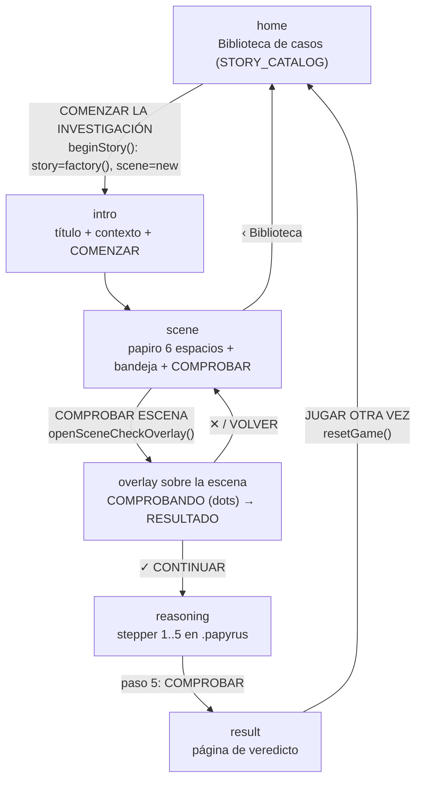
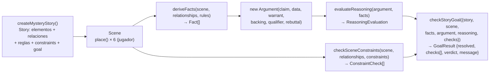
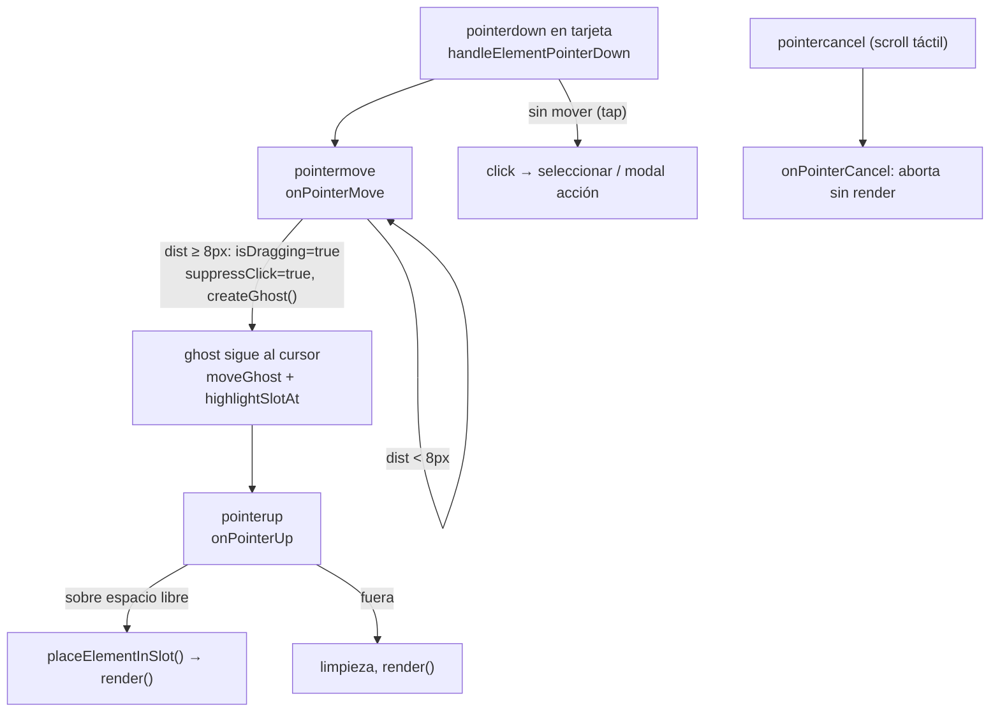

# Documentación del proyecto — para IAs

> Juego narrativo de investigación ("El misterio del robo"). Stack: TypeScript + HTML + CSS + Vite. Sin React, sin dependencias de UI.
> Idioma del jugador: **español**. Idioma interno del código: inglés/técnico.
> Lee este documento antes de modificar cualquier archivo.

## 1. Mapa del repositorio

```text
sebastian/
├── docs/
│   └── documentation.md        # este archivo
├── index.html                  # <main id="app"> + <script src="/src/main.ts">
├── styles/
│   └── main.css                # todo el CSS (~1700 líneas, por secciones)
├── vite.config.mjs
├── tsconfig.json
├── package.json                # scripts: dev | build | cli | validate | validate:scene | test
├── src/
│   ├── main.ts                 # entry web: monta la UI en #app
│   ├── core/                   # CORE: modelo de dominio, sin lógica de juego
│   │   ├── IStoryElement.ts    # interfaz + StoryElementTypes
│   │   ├── character.ts / location.ts / action.ts / evidence.ts / storyObject.ts
│   │   ├── scene.ts            # Scene (6 espacios) + SCENE_SLOT_COUNT
│   │   ├── relationship.ts / rule.ts / fact.ts / proposition.ts
│   │   ├── constraint.ts       # Constraint + kinds + parameters
│   │   ├── goal.ts             # Goal + GoalContext + GoalResolver
│   │   └── story.ts            # Story + StoryConfig
│   ├── game/                   # GAME: motor de decisión (fuente de verdad)
│   │   ├── deductions.ts       # deriveFacts
│   │   ├── constraintsCheck.ts # checkSceneConstraints
│   │   ├── reasoningCheck.ts   # evaluateReasoning, factsEqual, isFactAvailable
│   │   ├── goalCheck.ts        # checkStoryGoal
│   │   ├── stories/mystery/
│   │   │   ├── story.ts            # createMysteryStory() + datos del caso
│   │   │   ├── story.validate.ts   # validación del caso (tsx)
│   │   │   └── scene.validate.ts   # validación de generalización (tsx)
│   │   └── story/mystery/
│   │       └── elements.ts     # vacío (reservado)
│   ├── cli/
│   │   └── main.ts             # juego por terminal (readline)
│   └── ui/
│       └── mystery.ts          # TODA la UI web (~1000 líneas, un módulo)
└── dist/                       # salida de build (generado, no editar)
```

## 2. Arquitectura y regla de dependencia

```text
CORE  ←  GAME  ←  UI / CLI
(datos)  (decide)  (solo representa)
```

- **CORE** no importa nada del proyecto. Solo tipos y el contenedor `Scene`.
- **GAME** importa CORE. Aquí vive TODA la decisión: qué hechos se derivan, si la escena cumple, si el razonamiento es válido, si la historia se resuelve.
- **UI/CLI** importan CORE + GAME. Son adaptadores: leen estado, llaman al motor, renderizan el resultado. **Prohibido** decidir narrativa en UI (`if element === "Ana"`, listas paralelas de soluciones, etc.).
- Los textos al jugador están en español y vienen del motor (`messageIfMet/messageIfFailed`, `GoalCheckItem.label`, etc.). Nunca mostrar ids internos (`trophy-required`, `found_at`, `present_at`, `certain`, `claim`, …).

## 3. Diagrama de páginas / navegación (UI web)



- Fases (`AppPhase`): `'home' | 'intro' | 'scene' | 'reasoning' | 'result'`.
- `render()` limpia `#app` y pinta la fase. El overlay y el modal de acción son nodos flotantes en `document.body` (no cambian de fase).
- Razonamiento y veredicto conservan sus datos en variables closure entre pasos (no hay re-fetch).

## 4. Diagrama de flujo del engine (una jugada)



## 5. Diagrama de drag & drop (Pointer Events, mouse + touch + stylus)



- Alternativa sin arrastre: tap en elemento (selecciona, `selectedElementId`) → tap en espacio (`handleSlotPointerDown`).
- Quitar elemento: botón `×` del espacio (`removeFromSlot` → `scene.remove()`).
- Acciones (Entrar/Salir/Tomar): clic abre `showActionModal` con objetivos por `type`; `handleActionSelection` coloca acción + objetivo con `Toast` de confirmación.

## 6. Referencia por archivo

### `src/main.ts`
Entry web. `mountMysteryUI(app)` sobre `#app`. Sin lógica.

### `src/core/` — modelo (sin decisiones)

| Archivo | Exporta | Qué hace |
|---|---|---|
| `IStoryElement.ts` | `IStoryElement`, `StoryElementTypes` | Contrato de todo elemento: `id`, `type` (`character\|evidence\|action\|location\|object`), `name`, `description`, `pngUrl` (`string\|null` = gancho de sprites) |
| `character/location/action/evidence/storyObject.ts` | Clases homónimas | Implementan `IStoryElement`; `Character` añade `role/traits/properties` |
| `scene.ts` | `Scene`, `SCENE_SLOT_COUNT = 6` | 6 espacios (1-indexados). `place(el, slot)` (sobrescribe), `remove(slot)`, `get`, `isFilled`, `isComplete`, `getElements()` (en orden de espacio). `RangeError` si slot inválido o >6 iniciales |
| `relationship.ts` | `Relationship` | `{source, type, target}` (type libre, ej. `present_at`) |
| `rule.ts` | `Rule`, `FactFactory` | `{id, description, relationshipType, sourceType?, targetType?, produces(source,target,type): Fact}` |
| `fact.ts` | `Fact` | `{statement, involvedElements}` |
| `proposition.ts` | `Proposition` | `{statement}` (claim/warrant) |
| `constraint.ts` | `Constraint`, `ConstraintKind`, `ConstraintParameters` | kinds: `required\|forbidden\|order\|relationship\|evidence\|argument\|contradiction`; mensajes ES `messageIfMet/messageIfFailed` |
| `goal.ts` | `Goal`, `GoalContext`, `GoalResolver` | `resolvesWhen({claim, argument, derivedFacts, relationships, scene}): boolean` |
| `story.ts` | `Story`, `StoryConfig` | Agregado: `id/title/context/availableElements/scene/relationships/rules/constraints/goal` |

### `src/game/` — motor (fuente de verdad)

| Archivo | Función | Firma → retorno |
|---|---|---|
| `deductions.ts` | `deriveFacts` | `(scene, relationships, rules) → Fact[]`. Por cada relación con source+target presentes, aplica reglas del mismo `relationshipType` (respetando `sourceType/targetType`) |
| `constraintsCheck.ts` | `checkSceneConstraints` | `(scene, relationships, constraints, context?) → ConstraintCheck[]` (`{constraint, satisfied, message}`). Mensaje del constraint o genérico por kind |
| `reasoningCheck.ts` | `evaluateReasoning` | `(argument\|null, availableFacts) → ReasoningEvaluation` (`structurallyValid, checks[], claim, dataCount, hasWarrant, qualifier`). + `factsEqual`, `isFactAvailable` (igualdad por statement + ids) |
| `goalCheck.ts` | `checkStoryGoal` | `({story, scene, derivedFacts, argument, reasoningCheck, constraintChecks}) → GoalResult` (`resolved, checks[7 en ES], verdict, message`). Pasa la **escena evaluada** al resolver |

### `src/game/stories/mystery/story.ts` — datos del caso (NO lógica genérica)

`createMysteryStory(): Story`. 12 elementos: Ana, Carlos, Profesor, Salón, Pasillo, Trofeo, Cámara, Huella, Grabación de cámara, Entrar, Salir, Tomar. 5 relaciones (`present_at×2`, `has_access` Ana→Trofeo, `records`, `found_at`), 4 reglas (una por tipo), 3 constraints (`trophy-required`, `evidence-required`, `evidence-found-at-relation`), objetivo (el claim debe mencionar "trofeo" + exactamente 1 personaje de `[ana, carlos, profesor]` + datos que lo involucren). Escena por defecto: Ana/Salón/Trofeo/Huella/Cámara/Salir. Asimetría intencional: solo Ana tiene `has_access`; la huella está en el salón.

### `src/game/stories/mystery/*.validate.ts` — pruebas (ejecutar con `npx tsx <archivo>`)
- `story.validate.ts`: caso base, reglas, constraints, razonamiento incompleto/completo, objetivo Ana/Carlos.
- `scene.validate.ts`: generalización — escena Ana vs escena Carlos equivalente, round-trip de los 12 elementos, hechos con sus ids, paridad de resolución, `GoalContext.scene` = escena del jugador, mensajes sin tokens internos.

### `src/ui/mystery.ts` — UI completa

`mountMysteryUI(root)`. Estado closure: `story`, `scene`, `phase`, `selectedElementId`, `argument`, `constraintChecks`, `reasoningEvaluation`, `goalResult` + estado del stepper (`reasonStep`, `reasonFacts`, `claimText`, `dataIdx`, `warrantText`, `qualifierSel`, `rebuttalIdx`, `rebuttalText`) + drag (`dragElementId`, `dragGhost`, `isDragging`, `suppressClick`).

| Función | Qué hace |
|---|---|
| `render()` | Limpia `#app`, resetea drag, pinta la fase |
| `artHTML(el, mod)` / `coverHTML(story)` | Arte: `` si hay `pngUrl`, si no placeholder genérico con inicial del nombre; cover = emblema con inicial del título |
| `renderHome()` / `beginStory(entry)` | Biblioteca desde `STORY_CATALOG` (factories de GAME; solo lee `title/context/availableElements`). `beginStory` crea historia + escena frescas → `intro` |
| `renderIntro()` | Título/contexto genéricos + COMENZAR → `scene` |
| `renderScene()` / `renderElementBand()` | Papiro 6 espacios (3×2) + bandeja con scroll horizontal; conserva `scrollLeft`; marca seleccionados/colocados |
| `handleElementPointerDown/move/up/cancel` | Drag con umbral 8px, ghost, highlight, drop por coordenadas |
| `handleSlotPointerDown` | Tap-to-place con elemento seleccionado |
| `placeElementInSlot()` / `removeFromSlot()` / `firstEmptySlot()` | Solo usan API de `Scene`; devuelven `boolean`/re-renderizan |
| `handleElementClick` | Acciones → modal; resto → seleccionar (respeta `suppressClick` post-drag) |
| `showActionModal()` / `handleActionSelection()` | Objetivos filtrados por `type`; coloca acción + objetivo + `Toast` |
| `openSceneCheckOverlay()` | Llama al motor, estado COMPROBANDO (dots) → RESULTADO en la misma ventana; `✓→reasoning`, `✕→cerrar` |
| `renderReasoning()` + `paintReasonStep()` + `paint*Step()` | Stepper 1 conclusión → 2 pruebas (chips) → 3 explicación → 4 certeza (sellos → `ToulminQualifier`) → 5 objeciones (chips + texto) |
| `submitReasoning()` | Construye `Argument` y llama al motor (`evaluateReasoning` → `checkStoryGoal`) → `result` |
| `renderResult()` / `certaintyDots()` / `resetGame()` | Página de veredicto con datos del motor; reinicio total |
| `showToast()` / `escapeHtml()` / `certaintyLabel()` | Aviso efímero; escape HTML; `certain→Cierto…` |

### `src/cli/main.ts`
Versión terminal del mismo flujo (readline): muestra historia → elige 6 elementos → deriva hechos → constraints → construye argumento → reasoning → goal → veredicto. Usa la escena del jugador en todas las llamadas al motor.

### `styles/main.css` — secciones
`LAYOUT · HEADER · MAIN · PARCHMENT/SCENE · SCENE SLOT · ELEMENT IN SLOT · ART FRAME · SCENE POLISH · FOOTER · ELEMENT CARD · HOME · INTRO · SCENE ACTIONS · SHARED ACTION BUTTON · REASONING STEPPER · VERDICT PAGE · REDUCED MOTION · INSTRUCTIONS · HIDDEN · DRAG GHOST · ACTION MODAL · TOAST · SCENE CHECK OVERLAY · RESPONSIVE (1200/768/480 por ancho + max-height 640px en vertical + paisaje 6 columnas con max-height 500px)`. Tokens en `:root` (`--font-display/body`, `--color-*`, `--glass-*`, `--space-*`, dimensiones). Glass cálido translúcido solo en superficies secundarias; pergamino protagonista.

### Configuración
`index.html` (título genérico, `#app`), `vite.config.mjs`, `tsconfig.json` (`strict`, `rootDir: src`), `package.json`.

## 7. Comandos

```bash
npm run dev              # Vite, juego web
npm run build            # tsc + vite build (debe pasar siempre)
npm run cli              # versión terminal
npm run validate         # caso misterio
npm run validate:scene   # generalización Ana/Carlos
npm run test             # ambas validaciones
```

## 8. Contratos para futuras IAs

1. **Motor decide, UI representa.** Nueva necesidad de decisión → GAME, nunca UI.
2. **Nueva historia** = nueva factory tipo `createMysteryStory()` + 1 línea en `STORY_CATALOG`. La Home/intro/escena ya son genéricas.
3. **Sprites** = rellenar `pngUrl` en los elementos (y futura portada en `Story`); `artHTML`/`coverHTML` los consumen solos.
4. **Español al jugador, inglés en código.** Nuevos mensajes del motor en español, sin ids internos.
5. **Sin React ni deps nuevas** para efectos (CSS nativo: variables, Grid/Flex, keyframes, `prefers-reduced-motion`).
6. **Progreso entre historias**: el engine no lo provee; no inventarlo (la Home muestra posición honesta del catálogo).
7. Nota de auditoría: el resolver del objetivo localiza personajes por nombre sobre el array `characters` de la historia (genérico, necesario por claims en texto libre); la asimetría Ana/Carlos es dato narrativo intencional.
